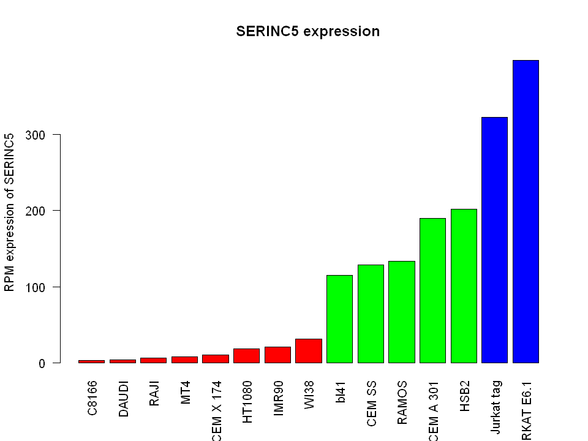

### Installing packages and loading
 

 
``` R
# install.packages("reshape")
# install.packages("BiocManager")
# install.packages("ggrepel")
# install.packages("corrplot")
# install.packages("pheatmap")
# BiocManager::install("ComplexHeatmap")
# BiocManager::install("AnnotationDbi")
# BiocManager::install("org.Hs.eg.db")
# BiocManager::install('PCAtools')
# install.packages("rlang")
# install.packages("gplots")
# install.packages("factoextra")
# install.packages("corrr")
# install.packages("ggcorrplot")
# install.packages("FactoMineR")
library('corrr')
library(ggcorrplot)
library("FactoMineR")
library(PCAtools)
library(reshape)
library("org.Hs.eg.db")
library(tibble)
library(dplyr)
library(ggplot2)
library(gplots)
library(ggrepel)
library(pheatmap)
library(dplyr, warn.conflicts = FALSE)
library(rlang)
library(factoextra)
library(vctrs)
```
 

 
### reading infect.txt and plotting {#reading-infecttxt-and-plotting}
 

 
``` R
# ------------Code for Ratio of the infectivity vs different cell types plot--------
setwd("D:/Study/SEMESTER 8/Biostats/datasets")
read.delim("infect.txt", fill=TRUE, header=FALSE ) -> infect_data
infect_data <- infect_data[order(infect_data$V2),]
infect_ratio <- infect_data$V2
names(infect_ratio) <- infect_data$V3

give_color <- function(value){
  if (value < 5) return("red")
  else if ( value < 25) return("green")
  else return("blue")
}
par(mar = c(6, 8, 4, 4)) # for margin around plot

color_vector <- unlist(lapply(infect_data$V2, give_color))
infect_data$V4 <- color_vector

barplot(infect_ratio, horiz = TRUE,
        las=2, xlab = "Nef+/Nef- infectivity ratio", col=color_vector,
        main = "Ratio of the infectivity vs different cell types", 
        border = 0)
```

 
  
 
 

 
### Reading htseq files and merging to dataframe
 

 
``` R
expression_df <- read.delim("SRR2166624.htseq",header = FALSE,col.names = c("ID","SRR2166624"))

# appending columns to expression_df from other htseq files using a for loop
for (i in 25:38){
  column_name <- paste("SRR21666",as.character(i), sep="")
  filename <- paste("SRR21666",as.character(i),".htseq", sep="") # generating the given filenames using a loop
  temp_df <- read.delim(filename,header = FALSE,col.names = c("ID",column_name)) 
  expression_df[,column_name] <- temp_df[,column_name] # appending new columns to expression_df 
}
# Changing column names to Cell line names from infect.txt file
colnames(expression_df) <- c( "ID",infect_data[order(infect_data$V1,decreasing=FALSE),]$V3)
# getting rid of summary values in the end of the dataframe
clean_df <- expression_df[1:58302,]
```
 

 
``` R
head(clean_df,10)
```

 

A data.frame: 10 × 17

| <!--/--> | ID &lt;chr&gt; | MT4 &lt;int&gt; | HSB2 &lt;int&gt; | HT1080 &lt;int&gt; | RAJI &lt;int&gt; | CEM SS &lt;int&gt; | DAUDI &lt;int&gt; | C8166 &lt;int&gt; | RAMOS &lt;int&gt; | IMR90 &lt;int&gt; | CEM A 301 &lt;int&gt; | CEM X 174 &lt;int&gt; | WI38 &lt;int&gt; | JURKAT E6.1 &lt;int&gt; | bl41 &lt;int&gt; | Jurkat tag &lt;int&gt; | gene_names &lt;chr&gt; |
|---|---|---|---|---|---|---|---|---|---|---|---|---|---|---|---|---|---|
| 1 | ENSG00000000003 |   0 |   64 |  71 |    0 |    0 |    0 |   2 |   0 |  963 |  0 |   0 |  572 |    0 |   0 |    4 | TSPAN6   |
| 2 | ENSG00000000005 |   0 |    1 |   0 |    0 |    0 |    0 |   0 |   0 |    0 |  0 |   0 |    0 |    0 |   0 |    0 | TNMD     |
| 3 | ENSG00000000419 | 535 |  707 | 535 |  888 |  706 |  424 | 655 | 542 | 1021 | 29 | 415 |  645 |  771 | 410 | 1128 | DPM1     |
| 4 | ENSG00000000457 | 643 |  643 | 165 |  604 |  490 |  475 | 292 | 362 |  470 | 13 | 109 |  496 | 1630 | 477 |  887 | SCYL3    |
| 5 | ENSG00000000460 | 885 |  826 | 143 |  648 |  808 |  654 | 354 | 555 |  441 | 22 | 140 |  317 | 2339 | 593 | 1428 | C1orf112 |
| 6 | ENSG00000000938 |   9 |    8 |   1 | 2977 |    3 | 1188 |  14 | 134 |    0 |  0 |  24 |    0 |   74 |  10 |   16 | FGR      |
| 7 | ENSG00000000971 |   1 |  228 |   5 |    0 |   16 |    0 |   0 |   0 |  971 |  2 |   0 | 2560 |    4 |   0 |    4 | CFH      |
| 8 | ENSG00000001036 | 174 |   12 | 334 |    0 |    4 |    4 |   2 |   2 | 2766 |  0 |   8 | 2069 |   55 |  12 |   15 | FUCA2    |
| 9 | ENSG00000001084 | 549 |  635 |  79 |  491 |  987 |  769 | 298 | 388 | 1231 | 26 | 105 | 1855 | 1319 | 769 | 1282 | GCLC     |
| 10 | ENSG00000001167 | 586 | 1015 | 232 | 1238 | 1116 |  616 | 994 | 535 | 1321 | 36 | 186 | 1063 | 3303 | 454 | 1657 | NFYA     |
 
 

 
### Cleaning up data and adding gene names column
 

 
``` R
clean_df$gene_names <- mapIds(org.Hs.eg.db, keys=clean_df$ID, keytype="ENSEMBL", column="SYMBOL") # adding new column with gene names
clean_df[is.na(clean_df$gene_names),17] <- "Unknown" # unknown gene names are converted to NA # adding new column gene names from accession number

cdf <- as.data.frame(sapply(clean_df[,c(-1,-17)], as.numeric))
cdf %>% mutate(zc = rowSums(. == 0)) -> cdf # counting zeros row wise
nonzero_cdf <- cdf[cdf$zc < 7,][-16] # filtering genes with non-zero expression in at least 50% cell lines

head(nonzero_cdf,10)
```

 
    'select()' returned 1:many mapping between keys and columns
 

 

A data.frame: 10 × 15

| <!--/--> | MT4 &lt;dbl&gt; | HSB2 &lt;dbl&gt; | HT1080 &lt;dbl&gt; | RAJI &lt;dbl&gt; | CEM SS &lt;dbl&gt; | DAUDI &lt;dbl&gt; | C8166 &lt;dbl&gt; | RAMOS &lt;dbl&gt; | IMR90 &lt;dbl&gt; | CEM A 301 &lt;dbl&gt; | CEM X 174 &lt;dbl&gt; | WI38 &lt;dbl&gt; | JURKAT E6.1 &lt;dbl&gt; | bl41 &lt;dbl&gt; | Jurkat tag &lt;dbl&gt; |
|---|---|---|---|---|---|---|---|---|---|---|---|---|---|---|---|
| 3 | 535 |  707 | 535 |  888 |  706 |  424 | 655 | 542 | 1021 | 29 | 415 |  645 |  771 | 410 | 1128 |
| 4 | 643 |  643 | 165 |  604 |  490 |  475 | 292 | 362 |  470 | 13 | 109 |  496 | 1630 | 477 |  887 |
| 5 | 885 |  826 | 143 |  648 |  808 |  654 | 354 | 555 |  441 | 22 | 140 |  317 | 2339 | 593 | 1428 |
| 6 |   9 |    8 |   1 | 2977 |    3 | 1188 |  14 | 134 |    0 |  0 |  24 |    0 |   74 |  10 |   16 |
| 7 |   1 |  228 |   5 |    0 |   16 |    0 |   0 |   0 |  971 |  2 |   0 | 2560 |    4 |   0 |    4 |
| 8 | 174 |   12 | 334 |    0 |    4 |    4 |   2 |   2 | 2766 |  0 |   8 | 2069 |   55 |  12 |   15 |
| 9 | 549 |  635 |  79 |  491 |  987 |  769 | 298 | 388 | 1231 | 26 | 105 | 1855 | 1319 | 769 | 1282 |
| 10 | 586 | 1015 | 232 | 1238 | 1116 |  616 | 994 | 535 | 1321 | 36 | 186 | 1063 | 3303 | 454 | 1657 |
| 11 |  44 |  144 |  58 |  266 |   19 |   67 |  79 |  63 |  489 |  0 |   2 |  318 |   50 | 131 |   51 |
| 12 | 359 |  638 | 346 |  708 |  234 |  241 | 438 | 271 | 5274 |  3 |  16 | 3876 | 1072 | 411 |  877 |
 
 

 
### Plotting overall expression of significant genes profile as heatmap
 

 
``` R
my_colors <- colorRampPalette(c("black", "black","brown","orange","yellow","white"))
heatmap(as.matrix(nonzero_cdf[order(nonzero_cdf$IMR90, decreasing = TRUE), ][0:1000,0:15]), col=my_colors(1000))
legend(x="right", legend=c("min", "med low", "med high", "max"),fill=my_colors(4))
```

 
  
 
 

 
### Normalizing data -\> getting RPM values
 

 
``` R
rpm_df <- clean_df

for (name in (colnames(rpm_df)[c(-17,-1)])){
col_total = sum(as.numeric(rpm_df[,name]))
current_col = rpm_df[,name]
rpm_df[,name] <- unlist(lapply(current_col, FUN = function(x) x*1000000/col_total))
}
rpm_df$name <- NULL
head(rpm_df,10)
```

 

A data.frame: 10 × 17

| <!--/--> | ID &lt;chr&gt; | MT4 &lt;dbl&gt; | HSB2 &lt;dbl&gt; | HT1080 &lt;dbl&gt; | RAJI &lt;dbl&gt; | CEM SS &lt;dbl&gt; | DAUDI &lt;dbl&gt; | C8166 &lt;dbl&gt; | RAMOS &lt;dbl&gt; | IMR90 &lt;dbl&gt; | CEM A 301 &lt;dbl&gt; | CEM X 174 &lt;dbl&gt; | WI38 &lt;dbl&gt; | JURKAT E6.1 &lt;dbl&gt; | bl41 &lt;dbl&gt; | Jurkat tag &lt;dbl&gt; | gene_names &lt;chr&gt; |
|---|---|---|---|---|---|---|---|---|---|---|---|---|---|---|---|---|---|
| 1 | ENSG00000000003 |  0.00000000 |  4.81296698 |  9.9611068 |   0.00000 |  0.0000000 |   0.000000 |   0.2057234 |  0.0000000 |  35.44316 |   0.000000 |   0.000000 |  24.70044 |   0.0000000 |  0.0000000 |  0.2356532 | TSPAN6   |
| 2 | ENSG00000000005 |  0.00000000 |  0.07520261 |  0.0000000 |   0.00000 |  0.0000000 |   0.000000 |   0.0000000 |  0.0000000 |   0.00000 |   0.000000 |   0.000000 |   0.00000 |   0.0000000 |  0.0000000 |  0.0000000 | TNMD     |
| 3 | ENSG00000000419 | 40.02970429 | 53.16824456 | 75.0590441 |  49.63045 | 57.0600174 |  44.760829 |  67.3744100 | 65.0361629 |  37.57784 |  94.991336 | 162.591306 |  27.85277 |  40.2618409 | 32.7002877 | 66.4541978 | DPM1     |
| 4 | ENSG00000000457 | 48.11046702 | 48.35527758 | 23.1490510 |  33.75765 | 39.6025616 |  50.144797 |  30.0356148 | 43.4374372 |  17.29832 |  42.582323 |  42.704704 |  21.41857 |  85.1190670 | 38.0439932 | 52.2560935 | SCYL3    |
| 5 | ENSG00000000460 | 66.21736129 | 62.11735502 | 20.0625109 |  36.21681 | 65.3038159 |  69.041468 |  36.4130399 | 66.5960708 |  16.23098 |  72.062393 |  54.850079 |  13.68888 | 122.1432501 | 47.2957819 | 84.1281866 | C1orf112 |
| 6 | ENSG00000000938 |  0.67339689 |  0.60162087 |  0.1402973 | 166.38496 |  0.2424647 | 125.414777 |   1.4400637 | 16.0790513 |   0.00000 |   0.000000 |   9.402871 |   0.00000 |   3.8643012 |  0.7975680 |  0.9426127 | FGR      |
| 7 | ENSG00000000971 |  0.07482188 | 17.14619485 |  0.7014864 |   0.00000 |  1.2931449 |   0.000000 |   0.0000000 |  0.0000000 |  35.73760 |   6.551127 |   0.000000 | 110.54743 |   0.2088811 |  0.0000000 |  0.2356532 | CFH      |
| 8 | ENSG00000001036 | 13.01900663 |  0.90243131 | 46.8592911 |   0.00000 |  0.3232862 |   0.422272 |   0.2057234 |  0.2399858 | 101.80246 |   0.000000 |   3.134290 |  89.34478 |   2.8721158 |  0.9570816 |  0.8836994 | FUCA2    |
| 9 | ENSG00000001084 | 41.07721057 | 47.75365671 | 11.0834850 |  27.44206 | 79.7708741 |  81.181787 |  30.6527850 | 46.5572531 |  45.30688 |  85.164646 |  41.137559 |  80.10371 |  68.8785579 | 61.3329786 | 75.5268454 | GCLC     |
| 10 | ENSG00000001167 | 43.84562002 | 76.33064812 | 32.5489687 |  69.19200 | 90.1968546 |  65.029884 | 102.2445245 | 64.1962124 |  48.61932 | 117.920279 |  72.872248 |  45.90309 | 172.4836062 | 36.2095868 | 97.6193314 | NFYA     |
 
 

 
### Correlation Plot
 

 
``` R
d <- cor(rpm_df[,c(-1,-17)])
library(corrplot)
corrplot(d)
```

 
  
 
 

 
### Establishing correlation of infect ratio with expression data
 

 
``` R
find_cor <- function(onerow){
sorted_infect_ratio <- arrange(infect_data,V1)$V2
cor_value <- suppressWarnings(cor.test(sorted_infect_ratio,as.numeric(as.vector(unlist(onerow))[c(-1,-17)])))
return(as.numeric(cor_value$estimate))
}

result_df <- rpm_df
result_df$cor_with_infect_ratio <- as.vector(apply(rpm_df,1,find_cor))
```
 

 
``` R
result_df_sorted <- arrange(result_df, desc(cor_with_infect_ratio))
result_df_sorted <- subset(result_df_sorted, !is.na(cor_with_infect_ratio))
result_df_sorted <- result_df_sorted[result_df_sorted$gene_names != "Unknown",]
head(result_df_sorted,10)
```

 

A data.frame: 10 × 18

| <!--/--> | ID &lt;chr&gt; | MT4 &lt;dbl&gt; | HSB2 &lt;dbl&gt; | HT1080 &lt;dbl&gt; | RAJI &lt;dbl&gt; | CEM SS &lt;dbl&gt; | DAUDI &lt;dbl&gt; | C8166 &lt;dbl&gt; | RAMOS &lt;dbl&gt; | IMR90 &lt;dbl&gt; | CEM A 301 &lt;dbl&gt; | CEM X 174 &lt;dbl&gt; | WI38 &lt;dbl&gt; | JURKAT E6.1 &lt;dbl&gt; | bl41 &lt;dbl&gt; | Jurkat tag &lt;dbl&gt; | gene_names &lt;chr&gt; | cor_with_infect_ratio &lt;dbl&gt; |
|---|---|---|---|---|---|---|---|---|---|---|---|---|---|---|---|---|---|---|
| 1 | ENSG00000164300 |   8.0059409 | 201.843803 | 18.6595381 |  6.7068174 | 128.910379 |   3.800448 |  3.6001593 | 134.032092 | 20.79479013 | 189.982672 | 10.9700158 | 31.48010923 | 397.500821 | 115.009304 | 322.903775 | SERINC5  | 0.9556150 |
| 2 | ENSG00000136104 | 104.4513405 | 165.445740 | 18.6595381 | 57.7904099 | 182.171783 | 113.802297 | 20.5723389 | 162.110435 | 14.02268148 | 186.707109 | 97.9465698 | 12.82522969 | 329.040025 | 180.968177 | 327.204446 | RNASEH2B | 0.9447338 |
| 3 | ENSG00000152580 |   9.6520222 |  20.154299 |  2.8059456 |  4.8624426 |   8.971193 |   0.105568 |  0.2057234 |  12.959235 |  0.07360988 |   9.826690 |  0.7835726 |  0.47500851 |  37.441945 |  12.123033 |  34.758845 | IGSF10   | 0.9341112 |
| 6 | ENSG00000100084 |  16.5356349 |  15.642143 |  7.2954585 | 13.0224038 |  19.397173 |  19.530079 |  7.9203505 |  20.398796 |  7.32418272 |  19.653380 |  7.8357256 |  8.11832721 |  35.718676 |  19.699929 |  35.171238 | HIRA     | 0.9254545 |
| 7 | ENSG00000144893 |  68.3871957 | 157.850276 | 14.0297279 | 36.3285943 |  73.628436 |   0.211136 |  1.7486488 |  85.794938 |  0.66248889 | 104.818026 |  0.7835726 |  1.12274738 | 215.774224 |  81.192422 | 248.731935 | MED12L   | 0.9243723 |
| 8 | ENSG00000144736 |  19.3788662 |  74.751393 | 36.3369952 | 48.7920966 | 103.936519 |  37.159934 | 28.1841043 |  58.316559 | 21.56769383 |  65.511266 | 39.9622005 | 23.36178202 | 149.820002 |  48.651648 | 200.187380 | SHQ1     | 0.9230484 |
| 9 | ENSG00000196839 |   0.1496438 | 114.458371 | 23.7102401 | 59.5788946 | 116.867968 |  17.524287 |  0.2057234 |  70.675830 |  4.41659259 | 157.227039 | 92.8533481 |  6.04556282 | 616.303821 |  78.959231 | 579.117699 | ADA      | 0.9217021 |
| 10 | ENSG00000172995 |   0.0000000 |   0.000000 |  0.1402973 |  0.3353409 |  49.058683 |   1.583520 |  0.0000000 |   2.159873 |  0.07360988 |  85.164646 |  0.3917863 |  0.04318259 | 224.495012 |  41.393779 | 163.896789 | ARPP21   | 0.9106440 |
| 11 | ENSG00000152475 |   1.7957251 |   4.136143 |  0.8417837 |  2.4032762 |   5.657509 |   2.322496 |  1.9543722 |   2.999823 |  2.46593086 |   3.275563 |  0.0000000 |  0.77728665 |   7.415281 |   4.386624 |   7.010682 | ZNF837   | 0.9074607 |
| 12 | ENSG00000163930 | 103.4038342 | 119.421743 | 59.0651543 | 69.9744616 | 160.673250 | 100.923002 | 66.1400696 | 107.633650 | 66.80096298 | 117.920279 | 52.1075751 | 62.74430551 | 217.654154 |  85.260018 | 284.669046 | BAP1     | 0.9069326 |
 
 

 
``` R
tail(result_df_sorted,10)
```

 

A data.frame: 10 × 18

| <!--/--> | ID &lt;chr&gt; | MT4 &lt;dbl&gt; | HSB2 &lt;dbl&gt; | HT1080 &lt;dbl&gt; | RAJI &lt;dbl&gt; | CEM SS &lt;dbl&gt; | DAUDI &lt;dbl&gt; | C8166 &lt;dbl&gt; | RAMOS &lt;dbl&gt; | IMR90 &lt;dbl&gt; | CEM A 301 &lt;dbl&gt; | CEM X 174 &lt;dbl&gt; | WI38 &lt;dbl&gt; | JURKAT E6.1 &lt;dbl&gt; | bl41 &lt;dbl&gt; | Jurkat tag &lt;dbl&gt; | gene_names &lt;chr&gt; | cor_with_infect_ratio &lt;dbl&gt; |
|---|---|---|---|---|---|---|---|---|---|---|---|---|---|---|---|---|---|---|
| 45675 | ENSG00000212978 |   9.726844 |   0.00000000 |  14.170025 |  16.934714 |   3.960256 |  10.979071 |  12.651988 |  8.879476 |   8.833185 |   0.000000 |   4.701435 |   9.716083 |   0.2611014 |   7.337626 |  0.1767399 | C2orf74-DT | -0.7101401 |
| 45676 | ENSG00000104312 |  10.699528 |   0.07520261 |  31.987780 |  39.011321 |   3.717791 |  22.485983 |  20.058030 | 20.038818 |  23.518356 |   0.000000 |  29.383971 |  23.793608 |   0.1566609 |  16.350144 |  0.0589133 | RIPK2      | -0.7134174 |
| 45677 | ENSG00000062716 | 443.918197 | 224.40458522 | 425.381349 | 233.229575 |  51.160044 | 100.500730 | 266.926098 | 43.677423 | 337.133235 |  68.786830 | 353.391224 | 363.856516 |  79.2181746 |  89.965669 | 49.8995617 | VMP1       | -0.7183227 |
| 45678 | ENSG00000169100 | 322.557112 | 279.15208457 | 280.734855 | 292.305458 | 156.632172 | 318.920909 | 339.340731 | 82.435136 | 152.630079 | 127.746969 | 301.283649 | 182.662362 | 116.3990186 | 209.999652 | 72.1098742 | SLC25A6    | -0.7360378 |
| 45679 | ENSG00000275538 |   5.013066 |   8.42269221 |  12.767052 |  15.313900 |  10.102694 |   9.817823 |  12.240542 |  7.559554 |  15.384464 |  13.102253 |  14.496092 |  11.875213 |   2.9243360 |   4.625894 |  3.0634914 | RNVU1-19   | -0.7399350 |
| 45681 | ENSG00000260916 |  11.821857 |  15.86775050 |  19.080430 |  13.916646 |   2.424647 |  12.245887 |  12.651988 |  5.039703 |  18.255249 |   3.275563 |   7.443939 |  15.113907 |   2.0365912 |   9.650573 |  2.0619654 | CCPG1      | -0.7540072 |
| 45682 | ENSG00000125611 |   5.836106 |   2.85769914 |   6.032783 |   9.110094 |   1.778074 |   6.861920 |   6.377425 |  5.039703 |   6.183230 |   0.000000 |   3.134290 |   2.936416 |   0.0000000 |   2.233190 |  0.0589133 | CHCHD5     | -0.7599675 |
| 45683 | ENSG00000198718 |  43.845620 |  10.30275743 |  21.605781 |  40.352685 |  22.145106 |  37.898910 |  39.498891 | 37.557784 |  34.559837 |  19.653380 |  28.600398 |  43.959878 |  10.8095993 |  22.810445 |  4.8898036 | TOGARAM1   | -0.7615864 |
| 45684 | ENSG00000102390 |  21.773166 |  21.13193313 |  20.623700 |  25.318236 |  26.105362 |  16.151903 |  29.932753 |  2.639844 |  21.310059 |  19.653380 |  21.548245 |  18.093506 |   0.0000000 |  12.601574 |  0.0589133 | PBDC1      | -0.8006257 |
| 45685 | ENSG00000116793 |  30.976257 |  19.85348877 |  49.104048 |  31.410261 |   8.971193 |  23.752799 |  33.430051 | 15.119108 |  39.491699 |  19.653380 |  22.331818 |  44.434887 |   3.2898780 |  30.227827 |  1.1193526 | PHTF1      | -0.8100852 |
 
 

 
``` R
result_df_sorted[result_df_sorted$gene_names=="SERINC5",]
```

 

A data.frame: 1 × 18

| <!--/--> | ID &lt;chr&gt; | MT4 &lt;dbl&gt; | HSB2 &lt;dbl&gt; | HT1080 &lt;dbl&gt; | RAJI &lt;dbl&gt; | CEM SS &lt;dbl&gt; | DAUDI &lt;dbl&gt; | C8166 &lt;dbl&gt; | RAMOS &lt;dbl&gt; | IMR90 &lt;dbl&gt; | CEM A 301 &lt;dbl&gt; | CEM X 174 &lt;dbl&gt; | WI38 &lt;dbl&gt; | JURKAT E6.1 &lt;dbl&gt; | bl41 &lt;dbl&gt; | Jurkat tag &lt;dbl&gt; | gene_names &lt;chr&gt; | cor_with_infect_ratio &lt;dbl&gt; |
|---|---|---|---|---|---|---|---|---|---|---|---|---|---|---|---|---|---|---|
| 1 | ENSG00000164300 | 8.005941 | 201.8438 | 18.65954 | 6.706817 | 128.9104 | 3.800448 | 3.600159 | 134.0321 | 20.79479 | 189.9827 | 10.97002 | 31.48011 | 397.5008 | 115.0093 | 322.9038 | SERINC5 | 0.955615 |
 
 

 
### Plotting SERINC5 expression
 

 
``` R
options(repr.plot.width=8, repr.plot.height=6)
SERINC5_expression <- as.vector(unlist(result_df_sorted[1,][,c(-1,-17,-18)]))
names(SERINC5_expression) <- colnames(result_df_sorted)[c(-1,-17,-18)]
barplot(sort(SERINC5_expression),las=2, col=arrange(infect_data,V2)$V4, main="SERINC5 expression", ylab="RPM expression of SERINC5")
```

 
  
 
 

 
### Plotting top positively and negatively correlated genes and comparing them with each other
 

 
``` R
correlation_plot <- function(rownumber){
gene_expression_rpm <- as.numeric(unlist(result_df_sorted[rownumber,]))[c(-1,-17,-18)]
sorted_infect_ratio <- arrange(infect_data,V1)$V2
sorted_infect_color <- arrange(infect_data,V1)$V4
plot(sorted_infect_ratio, gene_expression_rpm, pch=16, col=sorted_infect_color, main=result_df_sorted[rownumber,]$gene_names, xlab="Nef+/Nef- infectivity ratio", ylab=paste(result_df_sorted[rownumber,]$gene_names, " Expression RPM"))
abline(lm(gene_expression_rpm~sorted_infect_ratio), col="darkviolet")
}
```
 

 
``` R

top_positively_correlated <- c(1:10)
top_negatively_correlated <- c(29321:29312)

options(repr.plot.width=18, repr.plot.height=8)
# positively correlated vs infectivity ratio
par(mfrow=c(2,5))
for (i in top_positively_correlated){
  suppressWarnings(correlation_plot(i))
}
```

 
  
 
 

 
``` R
# negatively correlated vs infectivity ratio
options(repr.plot.width=18, repr.plot.height=8)
par(mfrow=c(2,5))
for (i in top_negatively_correlated){
  suppressWarnings(correlation_plot(i))
}
```

 
  
 
 

 
``` R
options(repr.plot.width=18, repr.plot.height=15)

compare_genes <- function(x,y){
x_axis = as.numeric(unlist(result_df_sorted[x,]))[c(-1,-17,-18)]
y_axis = as.numeric(unlist(result_df_sorted[y,]))[c(-1,-17,-18)]
x_label = paste(result_df_sorted[x,]$gene_names)
y_label = paste(result_df_sorted[y,]$gene_names)
title = paste(x_label ," vs ", y_label)
sorted_infect_color <- arrange(infect_data,V1)$V4
plot(x_axis, y_axis, main=title, xlab=x_label, ylab=y_label, pch=16, col=sorted_infect_color)
abline(lm(y_axis~x_axis), col="darkviolet")
}
# genewise comparisons
par(mfrow=c(5,5),mar = c(2, 2, 2, 2))
for (i in top_positively_correlated[1:5]){
  for (j in top_positively_correlated[1:5]){
    suppressWarnings(compare_genes(i,j))
  }
}
```

 
  
 
 

 
``` R
par(mfrow=c(5,5),mar = c(2, 2, 2, 2))
for (i in top_negatively_correlated[1:5]){
  for (j in top_negatively_correlated[1:5]){
    suppressWarnings(compare_genes(i,j))
  }
}
```

 
  
 
 

 
``` R
par(mfrow=c(5,5),mar = c(2, 2, 2, 2))
for (i in top_negatively_correlated[1:5]){
  for (j in top_positively_correlated[1:5]){
    suppressWarnings(compare_genes(i,j))
  }
}
```

 
  
 
 

 
### Expression profile of selected genes ( top 10 positive and top 10 negative ) in all cell lines {#expression-profile-of-selected-genes--top-10-positive-and-top-10-negative--in-all-cell-lines}
 

 
``` R
options(repr.plot.width=9, repr.plot.height=8)

selected_rpm_df <- result_df_sorted[c(top_positively_correlated,top_negatively_correlated),c(-1,-18)]
selected_rpm_df$positive_negative <- c(rep("red",10),rep("blue",10))

hm_matrix <- as.matrix(selected_rpm_df[,c(-16,-17)])
dimnames(hm_matrix) <- list(selected_rpm_df$gene_names,colnames(selected_rpm_df[,c(-16,-17)]))
par(mfrow=c(1,1),mar = c(8, 8, 8, 8), oma = c(2, 2, 2, 2))
heatmap.2(hm_matrix[,rev(infect_data$V3)], Rowv=FALSE, Colv=FALSE, dendrogram="none", trace="none", col=my_colors(1000))
```

 
  
 
 

 
### Plotting of each gene wrt cell lines ordered as decreasing infectivity ratio
 

 
``` R
options(repr.plot.width=12, repr.plot.height=10)

plot_single_expression <- function(rownum){
plot_data <- as.vector(unlist(result_df_sorted[rownum,][,c(-1,-17,-18)][,rev(arrange(infect_data,V2)$V3)]))
barplot(plot_data, las=2, col=rev(arrange(infect_data,V2)$V4), main=result_df_sorted[rownum,]$gene_names)
}

par(mfrow = c(4, 5), oma=c(0,0,3,0))
for (i in c(top_positively_correlated,top_negatively_correlated)){
  plot_single_expression(i)
}

mtext("Plotting of each selected genes ( 10 pos + 10 neg ) wrt all cell lines",line=0, side=3, outer=TRUE, cex=2)
```

 
  
 
 

 
### Plotting of each cell line wrt top 10 postitively regulating gene expression ( yellow ) followed by top 10 negatively regulating gene expression ( magenta ) {#plotting-of-each-cell-line-wrt-top-10-postitively-regulating-gene-expression--yellow--followed-by-top-10-negatively-regulating-gene-expression--magenta-}
 

 
``` R
# cell line wise barplot
par(mfrow = c(3, 5), oma=c(0,0,3,0))
for (i in rev(arrange(infect_data,V2)$V3)){
barplot(selected_rpm_df[,i], col=c(rep("yellow",10),rep("magenta",10)), main=i)
}
mtext("Plotting of each cell line wrt top 10 pos followed by top 10 neg gene expression",line=0, side=3, outer=TRUE, cex=2)
```

 
  
 
 

 
### Cell line wise PCA with selected 20 genes
 

 
``` R
corr_matrix <- cor(selected_rpm_df[,c(-16,-17)])
ggcorrplot(corr_matrix)
data.pca <- princomp(corr_matrix)
summary(data.pca)
fviz_eig(data.pca, addlabels = TRUE)
fviz_pca_var(data.pca, col.var = "cos2",
             gradient.cols = c("black", "orange", "green"),
             repel = TRUE)
```

 
    Importance of components:
                              Comp.1     Comp.2     Comp.3      Comp.4       Comp.5
    Standard deviation     1.2401501 0.36686257 0.14572103 0.074468813 0.0236121943
    Proportion of Variance 0.9044958 0.07915254 0.01248828 0.003261421 0.0003278919
    Cumulative Proportion  0.9044958 0.98364831 0.99613659 0.999398010 0.9997259024
                                 Comp.6      Comp.7       Comp.8       Comp.9
    Standard deviation     0.0157986882 0.013117286 6.201899e-03 1.784016e-03
    Proportion of Variance 0.0001467912 0.000101192 2.262077e-05 1.871783e-06
    Cumulative Proportion  0.9998726936 0.999973886 9.999965e-01 9.999984e-01
                                Comp.10      Comp.11      Comp.12      Comp.13
    Standard deviation     1.486180e-03 6.778050e-04 2.771130e-04 1.075734e-04
    Proportion of Variance 1.298975e-06 2.701890e-07 4.516187e-08 6.805619e-09
    Cumulative Proportion  9.999997e-01 9.999999e-01 1.000000e+00 1.000000e+00
                                Comp.14 Comp.15
    Standard deviation     3.502004e-05       0
    Proportion of Variance 7.212589e-10       0
    Cumulative Proportion  1.000000e+00       1
 

 
  
 

 
  
 

 
  
 
 

 
### Gene wise PCA with selected 20 genes
 

 
``` R
selected_rpm_transpose <- selected_rpm_df
rownames(selected_rpm_transpose) <- selected_rpm_transpose$gene_names
selected_rpm_transpose <- as.matrix(t(selected_rpm_transpose[,c(-16,-17)]))

corr_matrix <- cor(selected_rpm_transpose)
ggcorrplot(corr_matrix)
data.pca <- princomp(corr_matrix)
summary(data.pca)
fviz_eig(data.pca, addlabels = TRUE)
fviz_pca_var(data.pca, col.var = "cos2",
             gradient.cols = c("black", "orange", "green"),
             repel = TRUE)
```

 
    Importance of components:
                              Comp.1      Comp.2      Comp.3      Comp.4
    Standard deviation     3.2985029 0.264903129 0.212520846 0.176757157
    Proportion of Variance 0.9838526 0.006345567 0.004084128 0.002825207
    Cumulative Proportion  0.9838526 0.990198148 0.994282276 0.997107483
                                Comp.5       Comp.6       Comp.7       Comp.8
    Standard deviation     0.114376112 0.1009108285 0.0619880996 0.0541158735
    Proportion of Variance 0.001182952 0.0009208138 0.0003474665 0.0002648169
    Cumulative Proportion  0.998290435 0.9992112485 0.9995587150 0.9998235319
                                 Comp.9      Comp.10      Comp.11      Comp.12
    Standard deviation     3.239406e-02 2.348068e-02 1.454718e-02 1.081033e-02
    Proportion of Variance 9.489143e-05 4.985601e-05 1.913613e-05 1.056755e-05
    Cumulative Proportion  9.999184e-01 9.999683e-01 9.999874e-01 9.999980e-01
                                Comp.13      Comp.14      Comp.15 Comp.16 Comp.17
    Standard deviation     4.496442e-03 1.444776e-03 1.761413e-08       0       0
    Proportion of Variance 1.828245e-06 1.887545e-07 2.805554e-17       0       0
    Cumulative Proportion  9.999998e-01 1.000000e+00 1.000000e+00       1       1
                           Comp.18 Comp.19 Comp.20
    Standard deviation           0       0       0
    Proportion of Variance       0       0       0
    Cumulative Proportion        1       1       1
 

 
  
 

 
  
 

 
  
 
 
